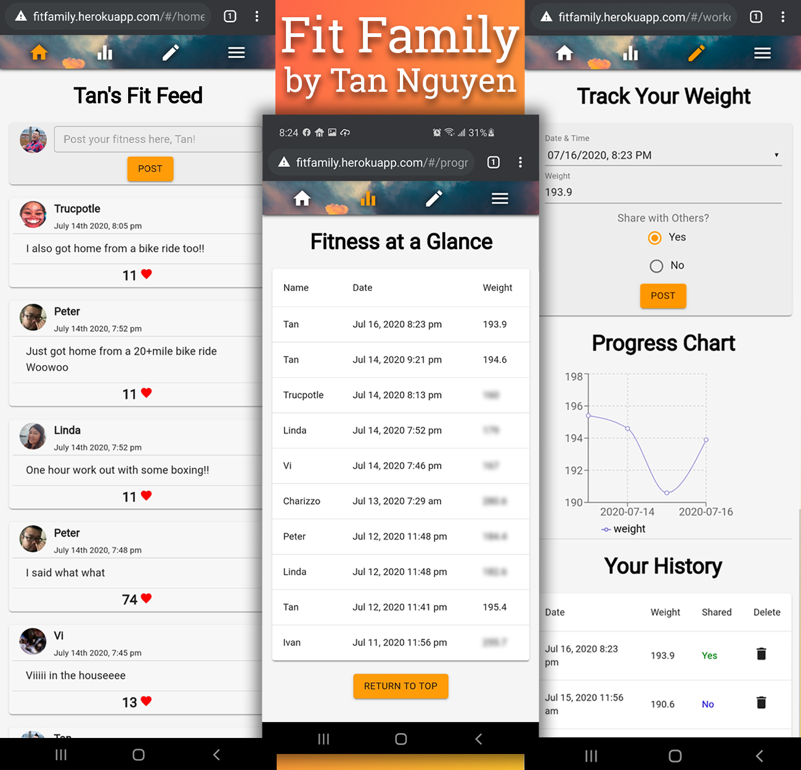

# Fit Family by Tan Nguyen

## Description

Last Updated: July 15th, 2020

Duration: 2 Days

Fit Family aims to motivate friends and family members to shed some of those pandemic pounds we've all put on.  It allows users to post their weight publically or privately and see this information in a useful chart.

To see the fully functional site, please visit: [YouTube](https://youtu.be/9vHi_lcmEuY)

## Screenshots of Fit Family



## Prerequisites

Software required to install this application are as listed:

* [Node.js](https://nodejs.org/en/)

* [PostgreSQL](https://www.postgresql.org/)

* [Nodemon](https://nodemon.io/)

## Installation

1.) Create a database named ```get_fit``` and run the queries from database.sql.

2.) The queries inside of the database.sql file are set to create the necessary tables to populate the needed data for this application to run correctly. This project is built on [Postgres](https://www.postgresql.org/), so you will need to make sure to have that installed. We recommend using [Postico](https://eggerapps.at/postico/) to run those queries as they were originally created there.

3.) Open your source code editor and run ```npm install```

3.) Create a .env file and set up SERVER_SESSION_SECRET=```superDuperSecretKey``` where ```superDuperSecretKey``` is your generated password. You can randomly generate a password here at [password generator](https://passwordsgenerator.net/).  If you don't do this step, create a secret with less than eight characters, you will get a warning. The secret value can be any random string of characters.

4.) Run ```npm run server``` in your terminal

5.) Run ```npm run client``` in your terminal which will open up a new browser with the application

## Built with

* PostgreSQL

* Express.js

* React.js

* Node.js

* Redux.js

* Redux-Saga

* Axios

* Moment.js

* Sweetalert2

* Material-UI

* Recharts

* Passport

## Contact Information

Tan Nguyen | tannguyen1024@gmail.com | 612-501-3800